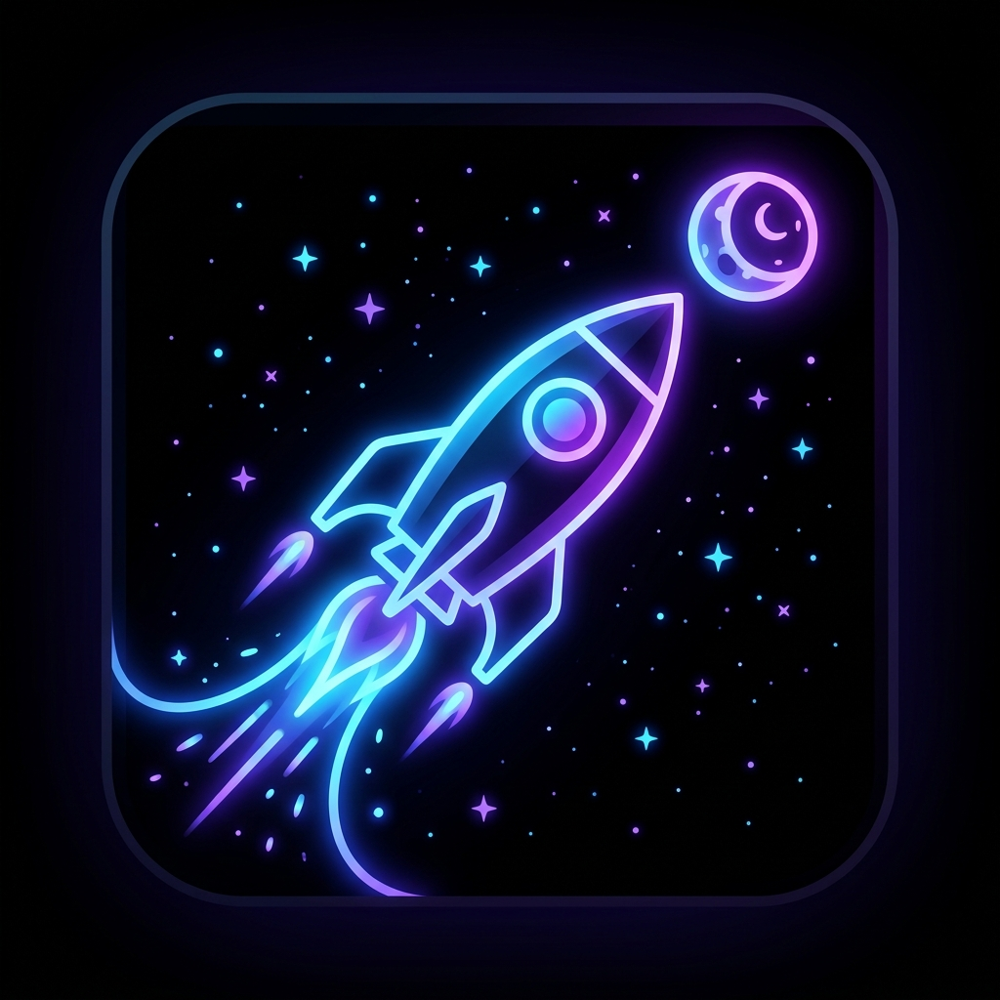

<div align="center">
  
  <h1>🚀 ARTEMIS II LIVE</h1>
  <a href="https://artemis2-live.vercel.app/">
    
  </a>
  <p><b>Experience Humanity’s Return to the Moon natively in your browser.</b></p>
  <i>"We go not just to visit, but to stay."</i>
</div>

<br/>

An immersive, real-time, emotionally engaging web architecture tracking the upcoming Artemis II mission. Built with a cinematic combination of an Apple Keynote aesthetic + NASA Mission Control utilitarianism.

---

## 🌒 Humanity & The Moon: A Brief History

For most of human history, the Moon was an untouchable celestial body. That changed on July 20, 1969, when Apollo 11 landed and Neil Armstrong took the first steps on the lunar surface. 

Between 1969 and 1972, the Apollo program saw **12 humans walk on the Moon**, concluding with Apollo 17. Since Commander Eugene Cernan left the last footprints in December 1972, no human has returned to deep space. 

For over 50 years, the frontier waited. Now, the Artemis generation is here.

## 🚀 The Artemis II Mission

**Artemis II** marks humanity's highly anticipated return to the lunar vicinity. It is the first crewed flight of the Space Launch System (SLS) rocket and the Orion spacecraft.

### The Crew
- **Commander:** Reid Wiseman
- **Pilot:** Victor Glover
- **Mission Specialists:** Christina Hammock Koch and Jeremy Hansen

### The Mission Profile
During this roughly 10-day mission, the crew will execute a Translunar Injection (TLI), launching them on a free-return trajectory. Orion will coast thousands of miles beyond the far side of the Moon—carrying humans further into the solar system than ever before—before Earth's gravity naturally pulls the spacecraft back home for a splashdown in the Pacific Ocean.

Artemis II is the crucial stepping stone for establishing the Lunar Gateway and a permanent human presence on the Moon, paving the way for humanity's next giant leap: Mars.

---

## 🌌 The Mission Dashboard Features

- 🛰️ **T-0 Cinematic Launch Sequence:** Wait on the dashboard until launch time, and watch an ultra-realistic procedural 3D Space Launch System (SLS) ignite and take over your screen as it thrusts into orbit.
- 📡 **Absolute True Telemetry:** A deterministic flight-path tracker synchronized exclusively to actual Artemis II scheduled milestones. Zero random mock variables—it mathematically simulates the actual Translunar Injection speeds!
- 🌎 **Photorealistic 3D Globe:** Deep space backgrounds, real global street light maps on the night side of the Earth, and dynamic orbiting components rendered at 60fps.
- 📜 **Scroll-Linked 3D Narrative:** Scroll through the historical chapters and watch the backdrop dynamically maneuver the 3D camera past the Earth, track the Orion capsule, and seamlessly enter a cinematic lunar orbit.
- 🎥 **NASA Live Broadcast Integration:** The dashboard directly taps into NASA's active 24/7 endpoint for live video coverage.

## 💻 Tech Stack Payload

* **Core Engine:** [Next.js App Router](https://nextjs.org/) + [React](https://react.dev/)
* **3D Renderer:** [Three.js](https://threejs.org/) & [@React-Three-Fiber](https://docs.pmnd.rs/) with `@react-three/drei`
* **Animation Thrusters:** [Framer Motion](https://www.framer.com/motion/)
* **Mission State Management:** [Zustand](https://github.com/pmndrs/zustand)
* **Visuals & Compositing:** [Tailwind CSS v4](https://tailwindcss.com/) with pure Glassmorphism utility overlays

---

## 👨‍🚀 Simulation Instructions (Local Setup)

Initialize the tracking station on your local machine:

```bash
# 1. Boot up dependencies
npm install

# 2. Ignite development server
npm run dev
```

*Open your visor at `http://localhost:3000` to enter the Mission Control dashboard.*

---
<div align="center">
  <b>Built for the final frontier.</b> 🌕
</div>
